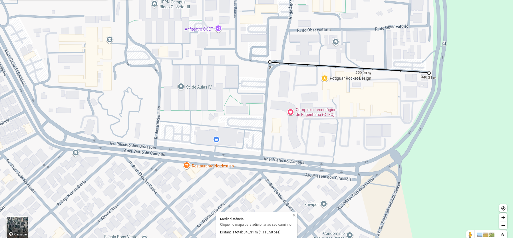
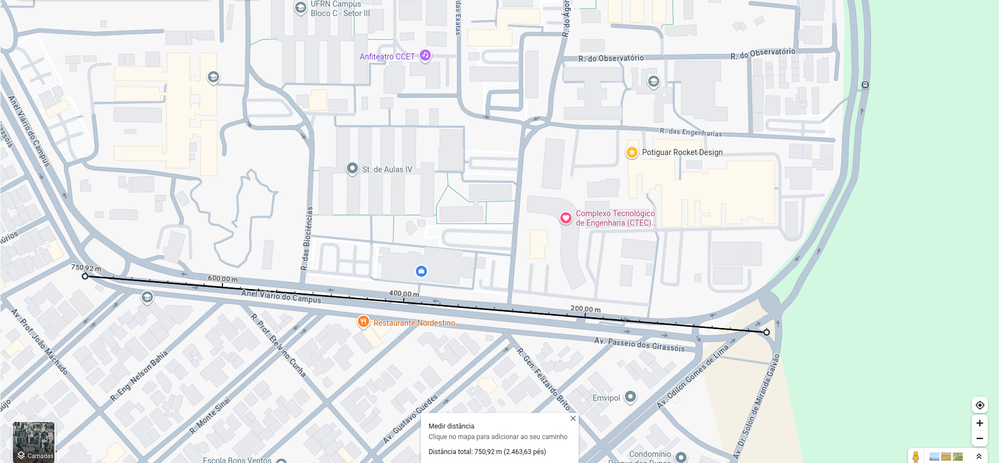

# Gravar dados da telemetria:
### ver: 
- [x] Arduino JSON;
- [x] Salvar na memoria do ESP
- [x] ver Pyserial para salvar os dados no PC: Fica muito mais facil de trabalhar em coisas separadas
 apenas para servir de cheklist temporario:
- [x] Criar o diretório de saída no PC
 ~~[] Configurar o arquivo dados_arduino.csv~~
~~-[ ] Instalar ArduinoJson no Arduino IDE~~
- [x] Modificar o código para gravar os dados no arquivo CSV
- [x] Configurar LoRa para receber pacotes
- [x] Salvar o arquivo CSV com o formato correto
~~- [ ] Verificar os dados salvos com ()~~
~~- [x] Testar com o Arduino JSON: SERÁ USADO O CARTAO SD/ESP E OS DADOS SALVO PELO Pyserial;~~
- [x] Exportar para o grupo ou compartilhar

- [x] ver "spiffs"
## Ver possivel porta com erro:
### ver:
 - [x] Uma porta do ESP estava danificada e teve que ser mudado, tem que ver se o codigo foi atualizado com a porta correta.

## EXPLICITAR QUAIS DADOS DEVEM SER SALVOS:

- [x] rxPacote.packet_id

- [x] rssi

- [x] pacotesRecebidos

- [x] pacotesPerdidos

- [x] prr

- [x] rxPacote.timestamp_ms

- [x] snr
# 

# ATUALIZAR CODIGO DO ESP:
## formatar o codigo do ESP de modo que:
-  todos os dados apresentados no motinor Serial fiquem na mesma posição e formato que os dados que serão salvos no SDcard.
# 
# Avaliar no código:
- [x] Devido o datasheet, eh necessario setar ente 11 ou 12 de LoRa.setSpreadingFactor():
        Ver se serah necessario mudar o valor da banda no LoRa.setSignalBandwidth(125E3), a unica frequencia disponivel é o RFS_L7.8_LF;
- [x] serah avaliado o LoRa.setCodingRate4(5) e o LoRa.setTxPower(2);

# NOVA MEDIÇÃO:
## Rua Das Engenharias (rua do PRD)
- [] 300m;

## Anel viário da UFRN (ECT-UFRN):
- [] 700m;

##  1km sera provavelmente na praia.